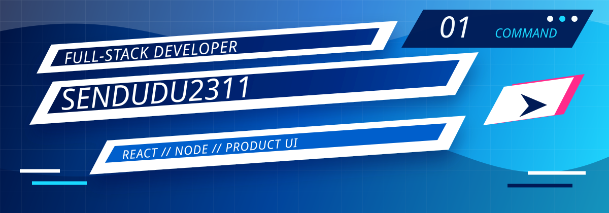
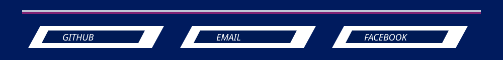

  

  

  

    
    
    
    
  

  

    
    
  

## Command Room

<table>
  <tr>
    <td width="34%" valign="top">
      <strong>Signal</strong>
       
      Full-stack developer focused on building product-like web experiences with sharp frontend detail and dependable backend flows.
    </td>
    <td width="33%" valign="top">
      <strong>Main route</strong>
       
      React, JavaScript, Node.js, Express, NestJS, MongoDB, Docker, CI/CD, GitHub Actions, and Playwright.
    </td>
    <td width="33%" valign="top">
      <strong>Current base</strong>
       
      Software Engineering student at <strong>FPT University HCM</strong>, building team projects and frontend-heavy systems.
    </td>
  </tr>
  <tr>
    <td width="34%" valign="top">
      <strong>Experience</strong>
       
      Former Frontend Developer (Vue.js) at <strong>FPT Software</strong>, now expanding across full-stack product engineering.
    </td>
    <td width="33%" valign="top">
      <strong>Ask me about</strong>
       
      React UI, Node APIs, MongoDB data flows, NestJS structure, end-to-end testing, and turning rough ideas into polished screens.
    </td>
    <td width="33%" valign="top">
      <strong>Build style</strong>
       
      Design the first impression, test the important paths, automate the boring parts, and keep the interface fast enough to feel alive.
    </td>
  </tr>
</table>

  

<h3>Frontend UI</h3>

  
  
  
  
  

<h3>Backend Core</h3>

  
  
  
  
  

<h3>Data, Delivery & Testing</h3>

  
  
  
  
  

  

<table>
  <tr>
    <td width="50%" valign="top">
      <h3>01 / Interface Feel</h3>
      

        I like screens with strong hierarchy, readable motion, bold visual rhythm, and details that make a web app feel intentional.
      

    </td>
    <td width="50%" valign="top">
      <h3>02 / Product Flow</h3>
      

        I care about the path from first click to finished task: navigation, empty states, responsive layout, and feedback after actions.
      

    </td>
  </tr>
  <tr>
    <td width="50%" valign="top">
      <h3>03 / Full-Stack Grip</h3>
      

        I connect frontend polish with backend structure: APIs, authentication, database flows, deployment, and maintainable services.
      

    </td>
    <td width="50%" valign="top">
      <h3>04 / Quality Route</h3>
      

        I use Playwright and CI/CD habits to protect the core user journeys, especially when UI-heavy projects keep moving fast.
      

    </td>
  </tr>
</table>

<table>
  <tr>
    <td width="50%" align="center">
      
    </td>
    <td width="50%" align="center">
      
    </td>
  </tr>
  <tr>
    <td width="50%" align="center">
      
    </td>
    <td width="50%" align="center">
      
    </td>
  </tr>
</table>

  

<table>
  <tr>
    <td width="100%" align="center">
      <h3>SkillVerse | Learning Universe Platform</h3>
      

        A shared full-stack learning platform project built around course exploration, structured skill development,
        and product-minded education flows, shaping UI experience,
        connecting full-stack features, and keeping the system ready for real users.
      

      

        
        
        
        
      

      

        
        
      

    </td>
  </tr>
</table>

  

## Connect

  

  
  
  

   
   

  

